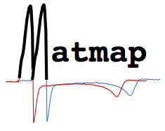
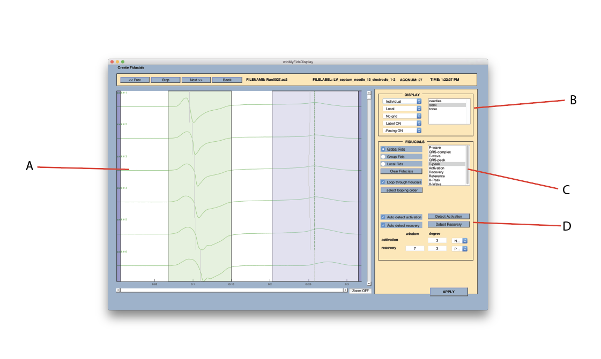
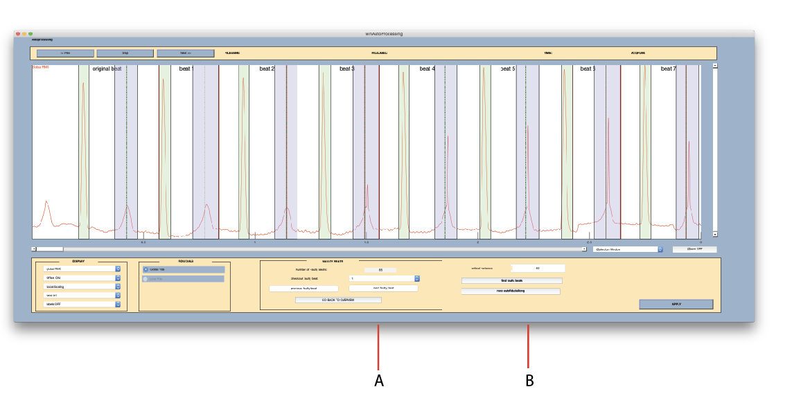

# Matmap3

# Matmap Documentation

## Matmap overview

Matmap is a signal processing tool specifically designed to process experimentally recorded  electrocardiography  data.  Matmap is designed to enable user guided processing on multi-channel data with several recording instances.  There are many available tools including baseline correction, cardiac signal feature selection, ativation and recovery time calculation, and many others.

## General Matmap Workflow

### Starting Matmap

Once you have downloaded the source code from the GitHub repository you can immediately open MatLab and begin using the testing functionality. To start Matmap change your Matlab working directory to the location Matmap is stored and type "matmap" in the Matlab command line.

The following two GUI windows should populate: 

### Processing Script Settings Window

A: Location of the processing script file. If opening for the first time Matmap will create a new processing script "ScriptData" in the current working directory. This file will store all the settings set lower in the window. 

B: Location of the processing data file. This is the location of the ProcessingData file created upon initializing matmap i.e. "helper files"

C: Input Directory. This is the location of the input directory, or the data you would like to input into Matmap

D: MATLAB output Directory: This is the location of the output data as created by the Matmap program (Matmap creates a series of .mat files following completion of the processing of input data) 

E: Baseline width: Width of the average used during isoelectric beat selection in order to perform baseline correction. 

F: Sampling frequency: This is the value of the sampling frequency used during the recording of the signals. 

G: Calibration File: Takes non-calibrated signals from the data to calibrated data. 

H: ACQ File Numbers for Calibration: the run file range that corresponds to the calibration files recorded before the experiment. 

I: Rungroup creation: Allows the user to create a rungroup 

J: Rungroup name: Name of the Rungroup created

K: Rungroup files: The range of run files applied to the Rungroup

L: Select Rungroup Files: a push button that will allow you to browse for rungroup files in a separate window

M: GroupName: Modifying or creating a group name for a specific set of channels

N: Lead Numbers: The lead numbers that correspond to the group name created above. 

O: Filename Extension: The extension name applied to the output files Matmap creates for the specific groups. 

P: Bad Leads: The channels that correspond to leads with poor signal quality. These numbers will be taken out of RMS calculation 

Q: File Extensions: The file types that Matmap will attempt to open

R: Group Name: Dropdown for selecting each individual group for editing M, N, O, and P. 

S: Geometry File: In progress

T: Channels File: In progress

U: Badleads File: In Progress 

V: Do Not process this group:  Keeps this group out of processing. 

W: Mapping File: This is the location of the .mapping file that describes which channels should be used and how they should be sorted from the Ac2 files.

### Processing Script Menu Window

A: Calibrate signal: Apply information from the premade calibration file to the imported dataset
B: Blank Bad Leads: Apply a zero value to leads marked as "bad leads" assigned. 
C: Apply Temporal Filter: Applies a band pass filter to the imported dataset.
D: User Interaction (Slice/Average Signal): Opens subsequent window that allows the user to select beat envelope.
E: Pre-RMS Baseline Correction: Stabilize signal using RMS signal before viewing in the Slice/Average signal window
F: User Interaction (Baseline correction): Confirming isoelectric points selected in the previous beat selection window. 
G: Baseline Correction (Baseline Correction): Fitting a linear baseline correction from two selected isoelectric points. 
H: Interpolate Bad Leads (Laplacian): In Progress (being worked on) 
I: User Interaction (Detect Fiducials and Baseline): Allow user to open user interaction to select fiducial point
J: Detect Fiducials: Detects previously fiducialized beats saved in the helper .mat file
K: Create Integral or Activation/Recovery Maps: Integrates between the fiducials specified and saves in a .mat file or creates a .mat file with n number of leads by 3 matrix (activation, recovery, and activation recovery interval) 
L:  Do Autofiducializing: Runs Autofiducializing algorithm to propagate automatically place fiducial points based on initial user input.  
M:  User Interaction (Autofiducializing): Allows user to interact with fiducializing selection from autofiducializing. 
Q: File Menu: Allows the user to select files from experiment to be analyzed 
R: Run Script: Runs the main Matmap script
S: Preprocess Files: Allows the user to section original experiment files into smaller sections and save them as .mat files. 
File Converter: Converting non-acq type files into a matmap readable file format. 

### Slice/Averaging Window

A: File Navigation: Navigates between beats in order shown in the processing script menu
B: Signal Viewer Window: Displays signal for file selected.
C: Display window Settings: Allows user to select what data to display.
D: Alignment Window Settings: In progress 
E: Averaging Settings: In Progress
F: Keep Bad Lead Settings: In Progress

### Baseline Correction Window

A: Signal Viewer Window: Displays signal for file selected.
B: Fiducial Selector: Allows user to modify baseline selected if not satisfactory in the slice averaging window. Both bounds should be set to zero 
C: Display Window Settings:  Allows user to modify visualization of data by group, apply labels, and modify offset. 

### Fiducial Selection Window

A: Signal Viewer Window: Displays signal for file selected.
B: Display Window Settings:  Allows user to modify visualization of data by group, apply labels, and modify offset. 
C: Fiducial Settings: Allows the user to select which fiducial is being identified and which data to apply the fiducial point.
**Select looping order: Allows user to specify the order that fiducial points will be selected and automatically change fiducial selector after each click. 
D: Auto-detection: Standard detection of activation and recovery times

### AutoFiducializing Window

A: Faulty Beats: Options to view faulty leads as detected during the autofiducializing process. 
B: Critical Variance: Defining the "critical variance" that will be used to select faulty leads during the autofiducializing process. 
